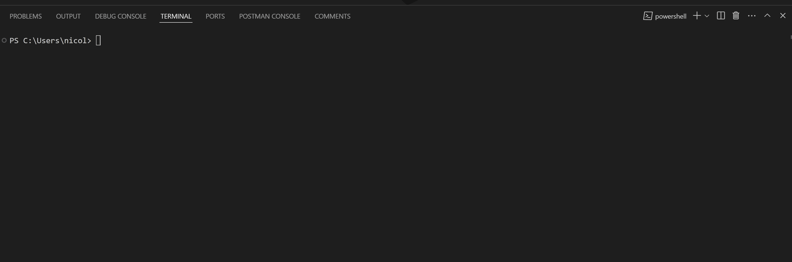

# Auction Item Management System


## Description

This project is an Auction Item Management System that allows users to manage auction items through a command-line interface (CLI). Users can add, find, update, remove, list, and seed auction items in a MongoDB database.

## Features

- Add auction items with various attributes.
- Find auction items by name, category, or description.
- Update existing auction items.
- Remove auction items.
- List all auction items.
- Seed the database with initial data.

## Demo

Here is a demo of the CLI tool in action:

<div style="border: 2px solid red; display: inline-block;">
  
</div>

## Technologies Used

- 
- 
- 
- 

## Installation and Setup

1. Clone the repository:
   ```bash
   git clone https://github.com/nicolegunn/cli-mongodb-crud-and-seed.git
   cd CLI-auction-items
   ```
2. Install dependencies:
   ```bash
   npm install
   ```
3. Set up environment variables:

   Create an .env file in the root directory and add your MongoDB URI:

   ```env
   MONGODB_URI=mongodb://127.0.0.1:27017/auction_items
   ```

4. Run the CLI tool:
   ```bash
   npm start
   ```
5. Install globally (optional)  
   This will allow you to run the tool from your terminal without cd-ing into the project directory.
   ```bash
   npm install -g .
   ```

## Usage

### List Commands

```bash
auction-cli --help
```

### Add an item:

```bash
auction-cli add
```

### Find items:

```bash
auction-cli find <item_name>
```

### Update an item:

```bash
auction-cli update <_id>
```

### Remove an item:

```bash
auction-cli remove <_id>
```

### List all items:

```bash
auction-cli list
```

### Seed the database:

```bash
auction-cli seed
```

## License

This project is licensed under the MIT License. See the [LICENSE](LICENSE) file for more details.
